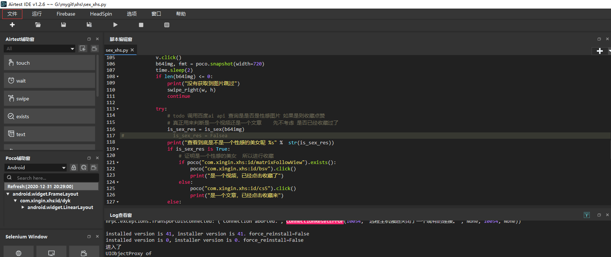
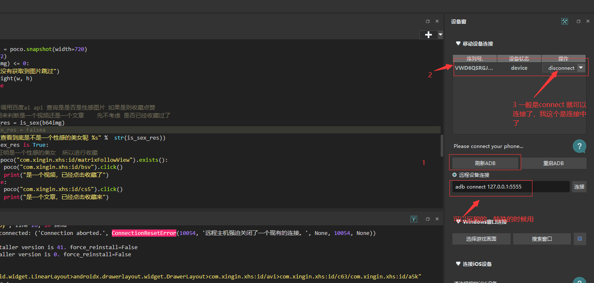

#怎么在小红书上找性感小姐姐
>看了这位大佬的 git
>https://github.com/wangshub/Douyin-Bot
>7.3k的start 果真的gayhub,不得不说这个作者大佬是真的nb
###废话不多说  怎么快速在小红书上找到性感的小姐姐
###上个图：这不是宅男的福利？ 不是新年最好的礼物？？？

###如何运行：
1. 首先你要装了 python3 如果不知道怎么装，可以百度一下
2. 这个脚本是基于adb+airtest+poco的 所以你需要安装 adb+airtest
   >2.1 安装adb : https://blog.csdn.net/weixin_43927138/article/details/90477966
   >2.2 安装 airtest 其实主要是安装他的编译器 就可以了,用于预览脚本有没有问题https://www.cnblogs.com/pengchongchong/p/10135276.html
                                             
3.百度ai 的token,这里怕你们麻烦，内置了一个，有条件换成自己的，至于怎么生成token 可以去百度id找一下，代码里面也有一个生成的方法

4.当你上面全部完成之后，我们就可以拿出你的安卓手机或者模拟器了，这个脚本是基于安卓的，所以有条件的拿个安卓手机，没有安卓的手机搞个模拟器，abd连接一下就好了

5.当你的模拟器或者手机装完小红书并开启调试模式！！！！之后，记得登陆，登陆之后你的君王生活即将开始了！！！

6. 导入脚本到airtestIDE编译器 这要是不会，就可以吃屎了
 

7. 用 AirTestIDE连接你的模拟器或者安卓手机

8.开始运行 

###效果预览 （等图吧）

##画外音
半天写的有bug只能提出来了，此项目仅供学习，娱乐，有问题就提issue吧

  
                                             